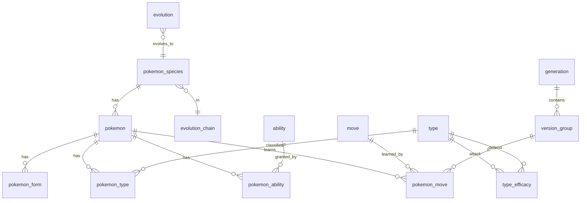

# 开发计划

本文按 [`project.md`](project.md) §41 的八节结构编写。数据源结论基于 2026-10-03 的实际抽样，阶段 0（D0-1～D0-10）实测结果已写回，报告在 `data/reports/`。标注 `[INFERENCE]` 的内容是推算，尚未实测，需要在对应任务中核实。

## 一、现状分析

**仓库状态**
- 仓库 `linxiks/pindex`，分支 master。
- 文档：`docs/project.md`（开发需求）、`docs/design.md`（UI/UX 设计）、本文、`README.md`、`LICENSE`、`NOTICE`、`DATA_SOURCES.md`。
- 阶段 0 产物：`tools/data-builder/fetch.py`（获取脚本）、`tools/phase0/`（覆盖率与对比脚本）、`data/metadata/sources.json`、`data/reports/*.md`。`data/raw/`、`data/normalized/` 不入库（`.gitignore`）。
- 阶段 1 产物：`tools/data-builder/build.py`（构建器）、`verify.py`（独立完整性检查）、`schema.sql`、`builder/`、`tests/`。输出 `data/generated/`（`pokedex.db`、`conflicts.csv`、`build-report.md`）不入库，由 `fetch.py` + `build.py` 重现。
- 尚无 Gradle 工程和应用代码。

**开发环境**
- Termux / Android arm64。已有 python3 3.14.6（sqlite 3.53.4）、node v24.18.0（原生 TypeScript 类型剥离可用）、OpenJDK 17、gradle 8.11.1（wrapper 缓存）、git、Android SDK（platforms 31/34/35/36，build-tools 34.0.0 / 35.0.0）。
- `build-tools/35.0.0/aapt2` 是 aarch64 原生二进制，可替代 AGP 自带的 x86_64 aapt2。D0-1 已在本机构建出 Compose APK（见第四节"构建环境注意"）。

**主要问题**
1. 中文来源中，许可证明确且可用的只有 PokeAPI（BSD-3-Clause）和 sindresorhus/pokemon（MIT，仅物种名，作校验）。42arch 的数据抓取自 52poke（CC BY-NC-SA 3.0），D0-9 判定不可用；wenitrys 没有任何许可证。
2. 没有任何来源授予图片使用权。PokeAPI/sprites 的 CC0 声明与"图像版权归 The Pokémon Company"并存。
3. PokeAPI 的 zh-Hans 图鉴说明只覆盖 sun～shield，缺 legends-arceus 及之后的作品（D0-4 实测，处理方案见第二节）。
4. Termux 下 AGP 的 NDK 工具链（`llvm-strip`）为 x86_64，无法运行；目前只影响原生库剥离，不影响构建结果（D0-1）。

## 二、数据源审计

### (a) 字段来源表

| 字段 | 数据来源 | 中文覆盖 | 完整度 | 许可证 | 最终采用来源 |
|---|---|---|---|---|---|
| 物种 / 宝可梦 / 形态 | PokeAPI CSV（species 1025、pokemon 1351、forms 1579 行） | 不适用 | 高 | BSD-3-Clause | PokeAPI |
| 属性与属性克制 | PokeAPI `type_efficacy`；Showdown `typechart.ts` | types zh-hans 21/21 | 高 | BSD-3-Clause / MIT | PokeAPI，Showdown 作校验 |
| 种族值 | PokeAPI `pokemon_stats`；Showdown `pokedex.ts` | 不适用 | 高 | 同上 | PokeAPI，Showdown 作校验 |
| 特性关系 | PokeAPI `pokemon_abilities` | 不适用 | 高 | BSD-3-Clause | PokeAPI |
| 学习面 | PokeAPI `pokemon_moves`（10.7 MB，638321 行）；Showdown `learnsets.ts`（3.7 MB） | 不适用 | 高；第 9 世代抽样 30 只，招式集合一致率 97.3% | 同上 | PokeAPI，Showdown 作校验 |
| 进化 | PokeAPI `pokemon_evolution`（34 列，676 行） | 不适用 | 高 | BSD-3-Clause | PokeAPI |
| 物种简体名 | PokeAPI `pokemon_species_names`（zh-hans）；sindresorhus `zh-hans.json` | 1025/1025 | 高；与 sindresorhus 差异 88 项 | BSD-3-Clause / MIT | PokeAPI，sindresorhus 作校验 |
| 物种繁体名 | PokeAPI `pokemon_species_names`（zh-hant）；sindresorhus `zh-hant.json` | 1025/1025 | 高；与 sindresorhus 差异 83 项 | 同上 | PokeAPI，sindresorhus 作校验 |
| 分类（genus） | PokeAPI `pokemon_species_names` | 1010/1025 | 高 | BSD-3-Clause | PokeAPI，缺失回退 zh-Hans → zh-Hant → en |
| 招式中文名 | PokeAPI `move_names` | 919/937（正作 919/919，缺的 18 个为 id ≥ 10001 的暗影招式） | 高 | BSD-3-Clause | PokeAPI，缺失回退 zh-Hans → zh-Hant → en |
| 特性中文名 | PokeAPI `ability_names` | 311/374（正作 311/314） | 中 | BSD-3-Clause | PokeAPI，缺失回退 zh-Hans → zh-Hant → en |
| 道具中文名 | PokeAPI `item_names` | 2172/2223 | 高 | BSD-3-Clause | PokeAPI，缺失回退 zh-Hans → zh-Hant → en |
| 招式 / 特性说明 | PokeAPI `move_flavor_text`、`ability_flavor_text` | zh-hans 只在 sun-moon～sword-shield 四个版本组；至少一条：招式 826/937，特性 267/374 | 中 | BSD-3-Clause | PokeAPI，回退 zh-Hans → zh-Hant → en |
| 图鉴说明 | PokeAPI `pokemon_species_flavor_text` | zh-hans 只在 sun～shield 8 个版本；至少一条 722/1025 | 中 | BSD-3-Clause | PokeAPI，回退 zh-Hans → zh-Hant → en |
| 日文名 | PokeAPI `ja`、`ja-hrkt` | 不适用 | 高 | BSD-3-Clause | PokeAPI |
| 性格、蛋组 | PokeAPI `natures`、`egg_groups`、`egg_group_prose` | 性格 25/25，蛋组 15/15 | 高 | BSD-3-Clause | PokeAPI |
| 成长速度、学习方式、进化触发方式名称 | PokeAPI `growth_rates`、`pokemon_move_methods`、`evolution_triggers` 的 identifier | 无（PokeAPI 这三类没有任何 zh-hans 名称） | 高 | BSD-3-Clause | 应用字符串资源按 identifier 映射；未收录的 identifier 显示 PokeAPI 英文名 |
| 地点、地区名称（进化条件用） | PokeAPI `location_names`、`region_names` | 进化用到的 17 个地点中 4 个有 zh-hans；地区 3/3 | 中 | BSD-3-Clause | PokeAPI，缺失回退 zh-Hans → zh-Hant → en |
| 图片 | PokeAPI/sprites | 不适用 | 高 | CC0 仓库，图像版权归 The Pokémon Company | PokeAPI/sprites（是否分发由 D4-7 决定，阶段 1～3 不打包图片） |

说明：
- 中文覆盖与完整度为 D0-4、D0-5、D0-6 在固定 commit 上的实测，详见 `data/reports/coverage.md`、`species-name-diff.md`、`showdown-diff.md`、`learnset-size.md`。
- 语言 id 由构建器按 `languages.identifier` 查找（当前 zh-hans=12、zh-hant=4、en=9、ja=11、ja-hrkt=1），不硬编码。`ja` 与 `ja-hrkt` 是两套独立文本（1025 个物种两者都有），分别入库。
- `sources.json` 共记录 48 个 PokeAPI CSV，表头在各文件的 `columns` 字段，导入代码以此为准。阶段 0 结束后为第三节补入 6 个：`growth_rate_prose`、`move_damage_class_prose`、`locations`、`location_names`、`regions`、`region_names`。与本文早期假设的差异：蛋组名称在 `egg_group_prose`（`egg_group_id,local_language_id,name`），不存在 `egg_group_names`；`pokemon_moves` 多出 `mastery` 列；`pokemon_evolution` 共 34 列，`raw_conditions` 须保存全部非空列（含 `condition_expression`、`version_group_id`、`percentage_chance`）；`items.csv` 没有世代列。
- 成长速度、学习方式、进化触发方式是封闭的小枚举（6、12、18 个），PokeAPI 没有中文。它们是界面用语，不是官方说明文本，由应用字符串资源提供中文，不违反"不自动生成官方中文"（`project.md` §15）。
- Showdown 的 `data/*.ts` 是 TypeScript 对象字面量，`moves.ts`、`abilities.ts`、`items.ts` 含函数，不能直接当 JSON 读。它只用于校验。D0-6 实际做法：`node tools/phase0/showdown_dump.mjs` 用 Node 24 原生类型剥离 `import` `typechart.ts`、`learnsets.ts`、`pokedex.ts`，再 `JSON.stringify` 到 `data/normalized/showdown/`，无需 esbuild 或文本解析器。

**说明文本缺口处理（D0-10）**
- PokeAPI 的 zh-Hans / zh-Hant 说明只存在于 sun～shield（图鉴说明）和 sun-moon～sword-shield（招式、特性说明）；legends-arceus、scarlet/violet 及之后的版本只有英文（部分有日文）。只有 722 个物种至少有一条中文图鉴说明，"最新有文本的版本"为中文的物种只有 550 个。
- 存储：说明按 (实体, 版本或版本组, 语言) 保存全部可得语言，不丢弃英文、日文。
- 显示：同一版本内按 zh-Hans → zh-Hant → en 回退，回退结果标注原语言（如"英文原文"）。
- 默认版本：详情页默认选中"该实体有 zh-Hans 或 zh-Hant 说明的最新版本"；没有中文说明时选有文本的最新版本。用户可切换到其他版本。
- 不翻译、不生成、不从无许可来源补缺（D0-9 已否决 42arch / 52poke）。

### (b) 与 `project.md` §19 的偏离

- `project.md` §19 把 pokemon-dataset-zh（42arch）排在第二位。
- D0-9 判定不可用：其数据抓取自 52poke，52poke 内容按 CC BY-NC-SA 3.0 授权，不能用于 `pokedex.db`（依据见 `DATA_SOURCES.md`）。不作为补缺层。
- 第一阶段中文回退顺序改为：PokeAPI zh-Hans → PokeAPI zh-Hant → 英文原文。
- wenitrys/pokemon-atlas-cn 没有许可证，不使用其任何文件。

## 三、数据库设计

分为只读图鉴库 `pokedex.db` 和用户库 `user.db`。所有 id 沿用 PokeAPI 的数字 id。文本语言码统一为 `zh-Hans`、`zh-Hant`、`en`、`ja`、`ja-Hrkt`，构建时按 `languages.identifier` 映射（当前 12→zh-Hans，4→zh-Hant，9→en，11→ja，1→ja-Hrkt）。`ja-Hrkt`（假名）单独存储，不并入 `ja`：两者同时存在，合并会使 `localized_name` 主键冲突。

导入范围（D0 实测后确定）：
- `type` 只导入 id < 10000（18 种常规属性加 `stellar`）；`unknown`、`shadow` 不导入。
- `move` 只导入 id < 10000（919 个）。18 个暗影招式（id ≥ 10001）没有 PP，也没有任何学习面引用它们。
- `ability` 只导入 `is_main_series=1`（314 个）。非正作特性（id ≥ 10001）没有中文名，也没有任何宝可梦引用它们。
- 名称表与说明表按同一范围过滤：被排除实体的 `*_names` / `*_flavor_text` 行不导入（实测 `type_names` 有 20 行属于 `unknown` / `shadow`，其余被排除实体没有说明文本）。
- 其余实体全量导入；`pokemon_move` 保留全部版本组（D0-7）。

### `pokedex.db`

| 表 | 列 | 主键 / 外键 / 索引 |
|---|---|---|
| `meta` | `key`, `value` | PK `key`。必须包含 `schema_version`、`data_version`、`build_date`、`source_versions`（JSON：来源 → commit） |
| `generation` | `id`, `identifier` | PK `id` |
| `version_group` | `id`, `generation_id`, `identifier`, `sort_order` | PK `id`；FK `generation_id` |
| `version` | `id`, `version_group_id`, `identifier` | PK `id`；FK `version_group_id` |
| `type` | `id`, `identifier`, `generation_id` | PK `id` |
| `type_efficacy` | `attack_type_id`, `defend_type_id`, `factor`（0/50/100/200） | PK (`attack_type_id`, `defend_type_id`)；两列均 FK `type` |
| `pokemon_species` | `id`（= 全国图鉴编号，D0 已核对与 `pokemon_dex_numbers` 全国图鉴一致）, `identifier`, `generation_id`, `evolution_chain_id`, `evolves_from_species_id`, `gender_rate`（-1 = 无性别）, `capture_rate`, `base_happiness`, `hatch_counter`, `growth_rate_id`, `is_baby`, `is_legendary`, `is_mythical`, `sort_order` | PK `id`；FK `generation_id`、`evolution_chain_id`、`evolves_from_species_id`、`growth_rate_id`；INDEX `generation_id` |
| `growth_rate` | `id`, `identifier` | PK `id` |
| `pokemon` | `id`（形态宝可梦为 10001+）, `species_id`, `identifier`, `height`, `weight`, `base_experience`, `is_default`, `sort_order` | PK `id`；FK `species_id`；INDEX `species_id`。`base_experience`（49 行）和 `sort_order`（139 行，id ≥ 899 的新条目）可为 NULL，列表排序用 (`species_id`, `id`) |
| `pokemon_form` | `id`, `pokemon_id`, `form_identifier`, `is_default`, `is_battle_only`, `is_mega`, `introduced_in_version_group_id`, `sort_order` | PK `id`；FK `pokemon_id`；INDEX `pokemon_id` |
| `pokemon_type` | `pokemon_id`, `slot`, `type_id` | PK (`pokemon_id`, `slot`)；FK 两列；INDEX `type_id` |
| `stat` | `id`, `identifier` | PK `id` |
| `pokemon_stat` | `pokemon_id`, `stat_id`, `base_value` | PK (`pokemon_id`, `stat_id`)；FK 两列 |
| `ability` | `id`, `identifier`, `generation_id` | PK `id`；FK `generation_id` |
| `pokemon_ability` | `pokemon_id`, `slot`, `ability_id`, `is_hidden` | PK (`pokemon_id`, `slot`)；FK 两列；INDEX `ability_id` |
| `move` | `id`, `identifier`, `type_id`, `damage_class_id`, `power`, `accuracy`, `pp`, `priority`, `generation_id` | PK `id`；FK `type_id`、`damage_class_id`、`generation_id`；`power`、`accuracy` 可为 NULL |
| `move_damage_class` | `id`, `identifier` | PK `id`。中文名来自 `move_damage_class_prose`（3/3） |
| `move_method` | `id`, `identifier` | PK `id` |
| `pokemon_move` | `pokemon_id`, `version_group_id`, `move_id`, `method_id`, `level`, `sort_order`, `mastery` | PK (`pokemon_id`, `version_group_id`, `move_id`, `method_id`, `level`)，`WITHOUT ROWID`；FK 四列；INDEX (`move_id`, `version_group_id`)。`level` 空值存 0；`sort_order`、`mastery`（传说 阿尔宙斯的精通等级，1882 行）可为 NULL |
| `evolution_chain` | `id`, `baby_trigger_item_id` | PK `id`；FK `baby_trigger_item_id` |
| `evolution_trigger` | `id`, `identifier` | PK `id` |
| `evolution` | `id`, `evolved_species_id`, `evolved_pokemon_form_id`, `version_group_id`, `is_default`, `trigger_id`, `min_level`, `trigger_item_id`, `held_item_id`, `known_move_id`, `known_move_type_id`, `gender_id`, `time_of_day`, `min_happiness`, `min_affection`, `min_beauty`, `location_id`, `region_id`, `trade_species_id`, `raw_conditions` | PK `id`；FK `evolved_species_id`、`evolved_pokemon_form_id`、`version_group_id`、`trigger_id`、各道具 / 招式 / 属性 / 地点 / 地区列；INDEX `evolved_species_id`。`raw_conditions` 保存 PokeAPI 原始行的全部非空列（JSON），覆盖未结构化的条件（如 `condition_expression`、`percentage_chance`、`party_species_id`、`needs_overworld_rain`），对应 `project.md` §9。同一物种可有多行：不同版本组的条件不同，形态进化各占一行（如 alcremie 63 行）；`is_default=0` 的 35 行是替代条件 |
| `location` | `id`, `region_id`, `identifier` | PK `id`；FK `region_id`（可为 NULL，实测 91 行无地区）。只用于进化条件显示 |
| `region` | `id`, `identifier` | PK `id` |
| `item` | `id`, `identifier`, `category_identifier` | PK `id`。`category_identifier` 由 `items.category_id` 关联 `item_categories` 得到；`items.csv` 没有世代列，不提供道具世代 |
| `nature` | `id`, `identifier`, `increased_stat_id`, `decreased_stat_id` | PK `id`；FK 两个 stat 列 |
| `egg_group` | `id`, `identifier` | PK `id` |
| `species_egg_group` | `species_id`, `egg_group_id` | PK 两列；FK 两列 |
| `localized_name` | `entity`, `entity_id`, `lang`, `name`, `genus`, `source` | PK (`entity`, `entity_id`, `lang`)，`WITHOUT ROWID`。`entity` 取值：species / pokemon_form / move / ability / item / type / nature / egg_group / stat / version / generation / growth_rate / move_damage_class / location / region。`lang` 取上面五个语言码。`genus` 仅 species 使用，空值存 NULL。name 为空字符串的源行跳过（实测 18 行形态名）。pokemon_form 取 `pokemon_form_names.form_name`；其 `pokemon_name` 列没有任何中文，不导入，形态完整名称由应用按"物种名 + 形态名"组合 |
| `species_flavor_text` | `species_id`, `version_id`, `lang`, `text`, `source` | PK (`species_id`, `version_id`, `lang`)；FK 前两列 |
| `move_flavor_text` | `move_id`, `version_group_id`, `lang`, `text`, `source` | PK 前三列加 `lang`；FK 前两列 |
| `ability_flavor_text` | `ability_id`, `version_group_id`, `lang`, `text`, `source` | PK 前三列加 `lang`；FK 前两列 |
| `search_index` | `term`, `entity`, `entity_id`, `display`, `priority` | PK (`term`, `entity`, `entity_id`)，`WITHOUT ROWID`，前缀查询直接走主键。`entity` 取值：species / move / ability / item。`term` 按"全文搜索方案"的规则规范化，同一实体的相同 `term` 只存一行（354 个物种简繁名相同）。`display` 为按回退规则解析后的中文显示名；没有 zh-Hans / zh-Hant / en 名称的实体不生成行。`priority`：0=中文名（zh-Hans / zh-Hant），1=英文名，2=日文名（ja / ja-Hrkt）；别名没有许可明确的来源，阶段 1 不生成 |

表结构定义在 `tools/data-builder/schema.sql`：
- 列类型只用 `INTEGER` 和 `TEXT`（布尔为 INTEGER 0/1），与 Room 的 schema 校验直接对应。
- 除以下可空列外全部 `NOT NULL`：`pokemon_species.evolves_from_species_id`、`pokemon.base_experience`、`pokemon.sort_order`、`pokemon_form.form_identifier`、`move.power`、`move.accuracy`、`pokemon_move.sort_order`、`pokemon_move.mastery`、`evolution_chain.baby_trigger_item_id`、`location.region_id`、`localized_name.genus`，以及 `evolution` 中除 `id`、`evolved_species_id`、`version_group_id`、`is_default`、`trigger_id`、`raw_conditions` 外的全部列。源 CSV 空字符串一律存 NULL（`pokemon_move.level` 例外，存 0）。
- 外键写成列级 `REFERENCES`；`localized_name`、`search_index` 是多态引用，不写外键，由完整性检查覆盖。
- 索引名按 Room 约定 `index_<表>_<列>`，如 `index_pokemon_move_move_id_version_group_id`。

约束：
- 任何表都不得用全国图鉴编号单独作为形态主键。形态走 `pokemon` 和 `pokemon_form` 两层。每个 pokemon 至少一个 form（实测无例外）；8 个 pokemon（koraidon / miraidon 的各形态）没有 `is_default=1` 的 form，应用取 `sort_order` 最小者。
- 库内只存真实文本：`lang` 就是文本的原语言，不写入回退副本。回退在读取时按 zh-Hans → zh-Hant → en 进行，结果带原语言标注；构建器只在生成 `search_index.display` 和报告时用同一规则。`source` 列记录数据源（阶段 1 均为 `pokeapi`）。
- flavor_text 原样存储（含 `\n`、`\f`、软连字符 `U+00AD`）。换行是游戏内排版，显示时由应用规范化：去掉"软连字符 + 换行"；中文去掉换行；日文换行改为全角空格；英文换行和 `\f` 改为空格。
- 不存储属性克制结果，运行时计算。克制计算只用 `type_efficacy` 中出现的 18 种属性；`stellar` 没有克制数据，宝可梦属性也只引用这 18 种。
- 所有外键在构建后由完整性检查验证，不依赖运行时开启外键约束。
- 数据源本身的缺口在构建报告中以警告列出，不算构建失败：9 个新超级进化形态（`zygarde-mega`、`heatran-mega` 等）没有特性；48 个超极巨化形态没有学习面（与默认形态共用）；3 个正作特性（312～314）没有中文名；正作特性 303 `embody-aspect` 未被任何宝可梦引用；道具 2278 `hopo-berry`、2279 `roseli-berry` 在任何语言都没有名称，不进 `search_index`；15 个物种（1011～1025）没有 zh-Hans genus。

### 全文搜索方案

- 用户输入与 `search_index.term` 使用同一规范化规则：NFKC（全角转半角）、小写、删除全部空白与 `#`。构建器实现见 `tools/data-builder/builder/search.py` 的 `normalize_term`，应用端用 Kotlin `Normalizer.normalize(s, Normalizer.Form.NFKC).lowercase()` 后删除空白与 `#`。
- 若匹配 `^0*(\d{1,4})$`，直接按 `pokemon_species.id` 精确查询，覆盖 `25`、`025`、`#025`。
- 否则先前缀匹配 `term LIKE q || '%'`，可用索引；再包含匹配 `term LIKE '%' || q || '%'`。合并去重，按（前缀命中优先, `priority`, `entity_id`）排序。
- 规模：D1-23 实测 `search_index` 15843 行，LIKE 扫描足够快。
- 验收：设备上单次查询 < 50 ms（D5-1 实测）。超出时改用 Room `@Fts4`。SQLite 默认分词器不切分中文，FTS 对"皮卡"→"皮卡丘"这类前缀有效，对中缀匹配无效，因此不作为首选。

### 数据版本方案

- `meta` 表记录 `schema_version`（与 Room 数据库版本对应，同时写入 `PRAGMA user_version`，供 Room 判断版本）、`data_version`（`sources.json` 中人工递增的整数）、`build_date`（`sources.json` 各来源 `retrieved` 的最大值，ISO 8601 日期；不取构建时刻，保证可重复）、`source_versions`（各来源的固定 commit，JSON）。
- `data/metadata/sources.json` 是版本的唯一录入点，构建器从中读取并写入 `meta`。
- Room 使用 `createFromAsset("pokedex.db")`。图鉴库只读，`schema_version` 变化时整库替换；用户数据在独立的 `user.db` 中，不受影响。

### `user.db`（独立数据库）

| 表 | 列 | 主键 / 说明 |
|---|---|---|
| `favorite` | `pokemon_id`, `created_at` | PK `pokemon_id` |
| `recent_view` | `pokemon_id`, `viewed_at` | PK `pokemon_id`；只保留最近 50 条 |
| `search_history` | `query`, `searched_at` | PK `query`；只保留最近 20 条 |
| `setting` | `key`, `value` | PK `key` |

- `user.db` 与 `pokedex.db` 之间没有物理外键。读取时与 `pokedex.db` 对照，忽略失效 id。
- 设置用 `setting` 表保存，不引入 DataStore，少一个依赖。

### 实体关系

- 一个 species 对应多个 pokemon（默认形态加地区形态、超级进化等），每个 pokemon 可有若干 form（外观形态）。
- 学习面是 pokemon × move × version_group × 学习方式 × 等级的多对多，同一招式可以多次出现。
- 进化行只记录"进化到"的 species 和触发条件，`evolves_from_species_id` 在 species 上。

## 四、安卓架构

**模块**
- 单模块 `app`，包结构照 `project.md` §28。
- 第一阶段不用 Hilt，在 `Application` 中手写 `AppContainer`，持有两个数据库和各个 Repository。
- 技术栈：Kotlin、Jetpack Compose、Material 3、Room、ViewModel、Coroutines/Flow、Navigation Compose、Coil。具体版本在 D2-1 确定并写入 `gradle/libs.versions.toml`，使用精确版本号。

**数据流**
- DAO（`suspend` 函数或 `Flow`）→ Repository（跨库合并、语言回退）→ ViewModel（`StateFlow<UiState>`）→ Composable。
- UI 层不直接访问 DAO。Repository 返回领域模型，不暴露 Room 实体。

**页面状态**
- 每个页面一个 sealed `UiState`：`Loading`、`Content`、`Empty`。
- 按 `design.md` §43，`Loading` 只显示骨架，不显示转圈遮罩。错误文案按 §46 用自然语言。

**导航**
- 底部四个一级页面：`pokedex`、`search`、`favorites`、`settings`。
- 详情路由：`pokemon/{pokemonId}`、`move/{moveId}`、`ability/{abilityId}`。
- 返回时保留滚动位置和筛选条件（`design.md` §42）：状态放在 ViewModel，列表用 `rememberLazyGridState` / `rememberLazyListState`。

**数据库访问**
- `pokedex.db`：Room `createFromAsset`，只读，DAO 只有查询。
- 图鉴列表约 1025 行，一次性读取，用 `LazyVerticalGrid` 渲染，不引入 Paging。
- 属性克制在 Repository 的纯 Kotlin 函数中计算：双属性时两个 `factor` 相乘，结果归为 4 / 2 / 1 / 0.5 / 0.25 / 0 六档。

**用户数据存储**
- `user.db`，独立 Room 数据库，版本和迁移独立于 `pokedex.db`。
- 替换 `pokedex.db` 不得影响收藏、最近查看、搜索历史和设置。

**构建环境注意**
- D0-1 实测（2026-10-03）：Termux arm64 上 `assembleDebug` 成功，产出 8.7 MB 的 debug APK，`aapt2 dump badging` 输出 `package: name='dev.pindex.spike'`，minSdk 26 / targetSdk 35。冷构建（含依赖下载）6 分 42 秒。
- 可用组合：Gradle 8.11.1、AGP 8.7.0、Kotlin 2.0.20（`kotlin-android` + `kotlin.plugin.compose`）、Compose BOM 2024.09.00、activity-compose 1.9.2、compileSdk 35、JVM 17。关键配置为 `gradle.properties` 中 `android.aapt2FromMavenOverride=/data/data/com.termux/files/usr/opt/android-sdk/build-tools/35.0.0/aapt2`，第一次即成功，无需回退到 `/data/data/com.termux/files/usr/bin/aapt2`。
- 已知问题：`stripDebugDebugSymbols` 调用 NDK 27.0.12077973 的 x86_64 `llvm-strip` 失败，AGP 退回为不剥离 `libandroidx.graphics.path.so`。只影响 APK 体积。release 构建若需剥离，在 CI 完成。
- D2-1 以此组合为起点；版本可升级，但每次升级都要在本机重新验证。GitHub Actions 仍作为发布构建环境（D5-3）。

**统一组件**（照 `design.md` §50，禁止各页面重复实现）
`PokemonCard`、`PokemonImage`、`TypeChip`、`GenerationChip`、`StatBar`、`DamageMultiplierGroup`、`InfoGrid`、`AbilityItem`、`MoveItem`、`EvolutionNode`、`SectionHeader`、`SearchBar`、`EmptyState`。

## 五、开发任务

任务编号规则：`D<阶段>-<序号>`。"依赖"列为空表示无前置任务。

### 阶段 0：数据可行性验证

| 编号 | 任务 | 输入 | 输出 | 验收 | 依赖 |
|---|---|---|---|---|---|
| D0-1 | 在 Termux 验证 AGP 构建空白 Compose APK | Android SDK、gradle | 结论记录到本文"七、风险"的构建环境条目 | 成功产出 APK；或记录失败原因并确定改用 CI 构建 | |
| D0-2 | 固定 Showdown 与 sindresorhus 的 commit | 两个仓库 | `data/metadata/sources.json` 中写入 commit；`DATA_SOURCES.md` 的"待固定"项补全 | 两个 commit 均为 40 位 SHA | |
| D0-3 | 下载 PokeAPI CSV 到 `data/raw/pokeapi/` | 固定 commit `bc92d3b6…` | 全部用到的 CSV；每个文件的 sha256 写入 `sources.json` | 文件齐全；重复执行结果一致；各 CSV 表头已记录 | |
| D0-4 | 覆盖率统计脚本 | D0-3 的 CSV | 各实体的 zh-Hans / zh-Hant / en / ja 覆盖率报告 | 报告含 species、move、ability、item、type、nature 及三类说明文本；species zh-Hans 为 1025/1025 | D0-3 |
| D0-5 | 物种中文名对比 | PokeAPI 名称、sindresorhus 的 zh-hans / zh-hant | 差异清单 | 列出全部不一致项；每项标注采用哪一方及理由 | D0-2, D0-3 |
| D0-6 | 学习面与属性表抽样对比 | PokeAPI `pokemon_moves`、`type_efficacy`；Showdown `learnsets.ts`、`typechart.ts` | 差异报告 | 属性表 18×18 全量比对；学习面至少抽样 30 只宝可梦（含形态）；记录 Showdown 解析方式（实际：Node 24 原生类型剥离，见第二节说明） | D0-2, D0-3 |
| D0-7 | 估算 `pokemon_move` 入库体积 | D0-3 的 `pokemon_moves.csv` | 全部版本组 vs 仅最新版本组的行数与 SQLite 体积 | 两种方案都有实测数字 | D0-3 |
| D0-8 | 实测图片体积 | PokeAPI/sprites，GitHub git trees API（非递归逐级下钻）。不用 blobless clone：在 partial clone 上执行 `git ls-tree -l` 需要读取 blob 大小，会按需下载全部 blob | 96px、official-artwork、home、shiny 的文件数与总字节数 | 四类均有实测数字，取代本文的推算 | |
| D0-9 | 澄清 42arch / 52poke 数据许可 | 52poke 站点许可说明、42arch 仓库 | 结论写入 `DATA_SOURCES.md` | 得出"可用 / 不可用 / 需联系作者"之一并附出处 | |
| D0-10 | 输出最终数据源映射表 | D0-4 ～ D0-9 | 更新本文第二节 | 所有字段都有唯一的最终采用来源；图鉴说明在 legends-arceus 之后的缺口有明确处理方案 | D0-4, D0-5, D0-6, D0-9 |

### 阶段 1：数据构建器（`tools/data-builder/`，Python 标准库，无第三方依赖）

| 编号 | 任务 | 输入 | 输出 | 验收 | 依赖 |
|---|---|---|---|---|---|
| D1-1 | 项目骨架与 `sources.json` 读取 | D0-3 | `tools/data-builder/build.py`、模块目录、测试目录 | `python tools/data-builder/build.py --help` 可运行 | D0-3 |
| D1-2 | 写 `schema.sql` | 本文第三节 | `tools/data-builder/schema.sql` | 可被 `sqlite3` 无错执行；表、主键、外键、索引与第三节一致 | D0-10 |
| D1-3 | 导入 generation / version_group / version / type / stat / move_method / move_damage_class / growth_rate / evolution_trigger / region / location | 对应 CSV | 对应表 | 行数与源 CSV 一致（type 按第三节导入范围） | D1-1, D1-2 |
| D1-4 | 导入 `type_efficacy` | `type_efficacy.csv` | 表，factor 为 0/50/100/200 | 行数与源一致；无其他取值 | D1-3 |
| D1-5 | 导入 `pokemon_species` | `pokemon_species.csv` | 表 | 1025 行，id 从 1 连续 | D1-3 |
| D1-6 | 导入 `pokemon`、`pokemon_form` | `pokemon.csv`、`pokemon_forms.csv` | 两张表 | 每个 pokemon 都有 species 和至少一个 form；无孤立 form；无默认 form 的 pokemon 恰为第三节列出的 8 个 | D1-5 |
| D1-7 | 导入 `pokemon_type`、`pokemon_stat` | 对应 CSV | 两张表 | 每个 pokemon 有 1～2 个属性、6 项种族值 | D1-6 |
| D1-8 | 导入 `ability`、`pokemon_ability` | 对应 CSV | 两张表 | 只含 `is_main_series=1`；除第三节列出的 9 个形态外，每个 pokemon 至少一个特性；隐藏特性均在 slot 3 | D1-6 |
| D1-9 | 导入 `move` | `moves.csv` | 表 | 919 行（id < 10000）；每个招式有属性、分类、PP（变化招式允许无威力） | D1-3 |
| D1-10 | 导入 `pokemon_move` | `pokemon_moves.csv`，D0-7 的结论 | 表，含 `mastery` | 638321 行（全部版本组）；无无效外键 | D1-6, D1-9 |
| D1-11 | 导入 `evolution_chain`、`evolution` | `evolution_chains.csv`、`pokemon_evolution.csv` | 两张表；`raw_conditions` 保存全部非空条件列 | 676 行；每行 `raw_conditions` 的键集合等于源行非空列集合 | D1-3, D1-5 |
| D1-12 | 导入 `item`、`nature`、`egg_group`、`species_egg_group` | 对应 CSV，`item_categories.csv` | 四张表 | 性格 25 行；道具 2223 行且都有 `category_identifier` | D1-5 |
| D1-13 | 导入 `localized_name` | 各 `*_names.csv`、`egg_group_prose`、`growth_rate_prose`、`move_damage_class_prose` | 表，含 `source`；五个语言码 | species zh-Hans 1025 行，ja 与 ja-Hrkt 各 1025 行 | D1-5, D1-9, D1-12 |
| D1-14 | 导入三张 flavor_text 表 | 各 `*_flavor_text.csv` | 三张表，含 `source` | 文本与源逐字节一致（不做换行规范化）；无自动生成内容 | D1-13 |
| D1-15 | 语言回退 | D1-13、D1-14 | 构建器内的纯函数：zh-Hans → zh-Hant → en，返回文本与原语言；用于 `search_index.display` 和报告，不写入回退副本 | 单元测试覆盖三种回退路径和全部缺失 | D1-13, D1-14 |
| D1-16 | 冲突日志 | sindresorhus `zh-hans.json` / `zh-hant.json` | `data/generated/conflicts.csv` | 列出全部物种简繁名差异（当前 171 行），PokeAPI 为采用值；冲突不静默覆盖。Showdown 对比仍由 `tools/phase0/showdown_diff.py` 单独生成报告，不在构建中执行 | D1-13 |
| D1-17 | 生成 `search_index` | 名称表 | 表 | 物种、招式、特性、道具的中文名、英文名、日文名均有记录；无重复 (`term`, `entity`, `entity_id`) | D1-13, D1-15 |
| D1-18 | 写入 `meta` | `sources.json` | `meta` 四项 | 四个键齐全，`source_versions` 为合法 JSON | D1-1 |
| D1-19 | 完整性检查：宝可梦 | 构建后的库 | `verify.py` 相关检查 | 覆盖 `project.md` §37：编号连续、无重复 id、缺中文名、缺属性、缺种族值、孤立形态 | D1-7, D1-13 |
| D1-20 | 完整性检查：招式与特性 | 同上 | 相关检查 | 招式检查 id、名称、属性、分类、PP；特性检查 id、名称、与宝可梦的关系 | D1-9, D1-8 |
| D1-21 | 完整性检查：外键 | 同上 | 相关检查 | 第三节列出的全部 FK 无无效引用（含 pokemon→species / type / ability / move、evolution→species / form / item / move / type / location / region、localized_name 与 flavor_text→对应实体）；可空 FK 只检查非 NULL 值 | D1-10, D1-11, D1-13, D1-14 |
| D1-22 | 构建器单元测试 | 小型 CSV 夹具 | `tools/data-builder/tests/` | 测试覆盖回退、形态、学习面主键；在干净环境可运行 | D1-15 |
| D1-23 | 生成 `pokedex.db` 并验证可重复 | 全部输入 | `data/generated/pokedex.db` | 连续两次构建的 sha256 一致；§37 全部检查通过；记录库体积 | D1-17 ～ D1-22 |

### 阶段 2：MVP（列表、搜索、详情基础）

| 编号 | 任务 | 输入 | 输出 | 验收 | 依赖 |
|---|---|---|---|---|---|
| D2-1 | 建立 Gradle 工程 | D0-1 的结论 | `app` 模块；`libs.versions.toml` 固定版本 | 空白 APK 可构建 | D0-1 |
| D2-2 | 主题与属性色 | `design.md` 视觉规范 | Material 3 主题；18 种属性色，亮/暗两套 | 预览中亮暗主题均可读 | D2-1 |
| D2-3 | `TypeChip` | D2-2 | 组件 | 18 种属性在预览中可区分；不只靠颜色（含文字） | D2-2 |
| D2-4 | `PokemonCard`、`PokemonImage` | D2-2 | 组件；图片失败时的占位（`design.md` §44） | 卡片信息不过载；图片缺失时不留空洞 | D2-3 |
| D2-5 | `GenerationChip`、`SearchBar`、`EmptyState`、`SectionHeader` | D2-2 | 四个组件 | 预览通过 | D2-2 |
| D2-6 | 静态原型：图鉴主页 | 组件、少量假数据 | 页面预览 | 中文名为视觉主体；搜索入口始终可见 | D2-4, D2-5 |
| D2-7 | 静态原型：详情页基础 | 组件、少量假数据 | 页面预览 | 无重复信息；无卡片套卡片 | D2-4 |
| D2-8 | 接入 `pokedex.db` | D1-23 | Room 实体与 DAO 骨架；构建时拷贝 db 到 assets | 仪器测试：数据库可打开，`meta.data_version` 正确 | D1-23, D2-1 |
| D2-9 | 列表 DAO | D2-8 | `PokemonListDao` | 测试：返回 1025 个默认形态，按编号排序 | D2-8 |
| D2-10 | 列表 Repository | D2-9 | Repository；中文名回退 | 测试：缺中文名时回退并标注 | D2-9 |
| D2-11 | 列表 ViewModel | D2-10 | `StateFlow<UiState>` | 测试：Loading→Content | D2-10 |
| D2-12 | 列表界面 | D2-6, D2-11 | 页面 | 真实数据下可滚动；返回保留位置 | D2-6, D2-11 |
| D2-13 | 世代筛选 | D2-12 | 筛选条件与 UI | 测试：选第 1 世代仅返回 151 只 | D2-12 |
| D2-14 | 搜索输入规范化 | `project.md` §5、§38 | 纯函数 `normalizeQuery` | 测试：`25`、`025`、`#025` 得到同一编号查询 | D2-1 |
| D2-15 | 搜索 DAO | D2-8, D2-14 | 编号精确、前缀、包含三类查询 | 测试：`皮卡丘`、`皮卡`、`Pikachu`、`25`、`025`、`#025` 均返回皮卡丘 | D2-8, D2-14 |
| D2-16 | 搜索 Repository 与 ViewModel | D2-15 | 排序、去重、防抖 | 测试：前缀命中排在包含命中前 | D2-15 |
| D2-17 | 搜索页 | D2-5, D2-16 | 页面 | 空结果有 `EmptyState` | D2-16 |
| D2-18 | 底部导航与路由 | D2-12, D2-17 | 四个一级页面 | 切换后各页面状态保留 | D2-12, D2-17 |
| D2-19 | 详情 DAO 与 Repository | D2-8 | 基础资料、属性、形态列表 | 测试：皮卡丘资料正确 | D2-8 |
| D2-20 | `StatBar` | D2-2 | 组件 | 六项种族值易于比较（`design.md` §61） | D2-2 |
| D2-21 | 详情页基础资料与种族值 | D2-7, D2-19, D2-20 | 页面 | 真实数据下显示正确 | D2-19, D2-20 |
| D2-22 | 阶段 2 UI 检查 | `design.md` §61 清单 | 检查记录 | 清单 15 项全部勾选，才能进入视觉细节打磨 | D2-18, D2-21 |

### 阶段 3：关联查询

| 编号 | 任务 | 输入 | 输出 | 验收 | 依赖 |
|---|---|---|---|---|---|
| D3-1 | 属性克制计算 | `type_efficacy` | 纯 Kotlin 函数 | 测试：单属性、双属性、免疫（如烈咬陆鲨对冰为 4 倍，幽灵打一般为 0） | D2-8 |
| D3-2 | `DamageMultiplierGroup` 与详情页接入 | D3-1 | 组件与页面区块 | 倍率一眼可读；分组为 4 / 2 / 0.5 / 0.25 / 0 | D3-1, D2-21 |
| D3-3 | 进化链数据读取 | `evolution` | Repository 返回进化树 | 测试：普通等级进化 | D2-8 |
| D3-4 | 进化条件文案 | `raw_conditions` | 条件到中文文本的映射 | 测试：石头、交换、多分支（伊布）、特殊条件各一例 | D3-3 |
| D3-5 | `EvolutionNode` 与进化区块 | D3-4 | 组件与页面区块 | 节点可点击跳转到对应宝可梦 | D3-4, D2-21 |
| D3-6 | 特性区块与 `AbilityItem` | D2-19 | 组件、区块 | 隐藏特性有明确标识 | D2-21 |
| D3-7 | 特性详情页 | `ability` 与 flavor_text | 页面与路由 | 列出拥有该特性的宝可梦 | D3-6 |
| D3-8 | 可学习招式查询 | `pokemon_move` | DAO 与 Repository，按版本组与学习方式分组 | 测试：指定版本组返回正确招式集 | D2-19 |
| D3-9 | `MoveItem` 与招式区块 | D3-8 | 组件与区块；版本选择 | 列表便于快速扫描 | D3-8, D2-21 |
| D3-10 | 招式详情页 | `move` 与 flavor_text | 页面与路由 | 显示属性、分类、威力、命中、PP；列出可学习的宝可梦 | D3-9 |
| D3-11 | 形态切换 | `pokemon`、`pokemon_form` | 形态选择器 | 测试：阿罗拉、超级进化形态的属性与种族值与默认形态区分 | D2-21 |
| D3-12 | 关联路径检查 | `design.md` §55 路径 E | 检查记录 | 宝可梦→招式→宝可梦可连续跳转，返回逐级正确 | D3-7, D3-10, D3-5 |

### 阶段 4：用户数据与完善

| 编号 | 任务 | 输入 | 输出 | 验收 | 依赖 |
|---|---|---|---|---|---|
| D4-1 | 建立 `user.db` | 第三节 | Room 数据库、DAO | 仪器测试：增删查 | D2-1 |
| D4-2 | 收藏 | D4-1 | 收藏开关、收藏页 | 替换 `pokedex.db` 后收藏保留；空状态按 §45 | D4-1, D2-18 |
| D4-3 | 最近查看 | D4-1 | 记录与展示 | 超过 50 条自动淘汰最旧 | D4-1, D2-21 |
| D4-4 | 搜索历史 | D4-1 | 记录与展示 | 超过 20 条自动淘汰最旧；可清空 | D4-1, D2-17 |
| D4-5 | 高级筛选 | D2-13 | 底部抽屉：世代、属性 | 组合筛选结果正确 | D2-13 |
| D4-6 | 设置页 | D4-1 | 主题、数据版本、开源许可证入口 | 数据版本显示 `meta` 的内容 | D4-1 |
| D4-7 | 图片策略决策 | D0-8 的实测、版权结论 | 决策记录（打包 / 按需下载 / 仅属性图标 / 不含图） | 决策引用实测体积与版权结论 | D0-8 |
| D4-8 | 按决策实施图片策略 | D4-7 | 实现 | APK 体积符合决策设定的上限；图片缺失时表现正常 | D4-7, D2-4 |

### 阶段 5：性能与发布

| 编号 | 任务 | 输入 | 输出 | 验收 | 依赖 |
|---|---|---|---|---|---|
| D5-1 | 搜索性能基准 | 真实库 | 基准测试 | 设备上单次查询 < 50 ms；超出则改用 FTS | D2-15 |
| D5-2 | 冷启动与列表性能基准 | 真实应用 | 测量记录 | 记录冷启动时间和滚动掉帧 | D2-12 |
| D5-3 | GitHub Actions 工作流 | 构建器、Gradle 工程 | CI 配置：构建数据 → 校验 → 构建 APK | 推送后 CI 产出 APK | D1-23, D2-1 |
| D5-4 | 签名与 Release | D5-3 | 签名配置（密钥不入库） | CI 产出已签名 APK | D5-3 |
| D5-5 | 许可证页面 | `NOTICE`、`DATA_SOURCES.md` | 应用内页面 | 页面展示 NOTICE 全文与各来源署名 | D4-6 |

## 六、开发顺序

| 优先级 | 范围 | 说明 |
|---|---|---|
| P0 | 阶段 0、阶段 1 | 数据是全部功能的前提。`project.md` §39 明确规定数据可行性阶段完成前不进入正式数据库开发 |
| P1 | 阶段 2 | 列表、搜索、详情基础，第一个可用版本 |
| P2 | 阶段 3 | 属性克制、进化、特性、招式、形态等关联查询 |
| P3 | 阶段 4、阶段 5 | 用户数据、图片策略、性能、CI 与发布 |

依赖关系：
- 阶段 1 依赖 D0-3（原始数据）和 D0-10（字段权威来源）。
- 所有安卓任务依赖 D0-1（确认能否构建）。
- 阶段 2 中接入真实数据依赖 D1-23。静态原型（D2-2 ～ D2-7）只需 D2-1，可与阶段 1 并行。
- 图片策略（D4-7）依赖 D0-8，但实施推迟到阶段 4，之前 `PokemonImage` 使用占位。
- 阶段 3 的进化和招式任务依赖对应的构建器表（D1-10、D1-11）已在 D1-23 中完成。

## 七、风险

**中文数据缺失**
- 现象（D0-4 实测）：招式缺 18 个中文名（全部是 id ≥ 10001 的暗影招式，正作 919/919）；特性缺 63 个（正作缺 3 个：312 eelevate、313 fire-mane、314 aura-guard，其余 60 个为 id ≥ 10001 的非正作特性）；道具缺 51 个（多为旧版信件与剧情道具）；genus 缺 15 个；形态名 zh-Hans 只有 247/618。图鉴说明的 zh-Hans 只覆盖 sun～shield，325 个物种没有任何中文图鉴说明。
- 对策：按 zh-Hans → zh-Hant → en 回退并在 `source` 记录；不自动生成或伪造官方中文（`project.md` §15）；42arch / 52poke 经 D0-9 否决，不作补缺。说明文本的版本选择规则见第二节"说明文本缺口处理"。

**数据源冲突**
- 现象：PokeAPI、Showdown、sindresorhus 对同一字段可能不一致。
- 对策：PokeAPI 为权威；差异写入 `conflicts.csv`，由 D0-5、D0-6 先行抽样，构建器不静默覆盖。

**形态建模**
- 现象：形态 id 从 10001 起，多个形态共享全国图鉴编号；Showdown 的形态条目同样共享 `num`。
- 对策：`pokemon_species` / `pokemon` / `pokemon_form` 三层；用户库记录 `pokemon_id`；图鉴编号不作主键。

**学习面数据量**
- 现象：`pokemon_moves.csv` 原始 10.7 MB、638321 行，为最大的 CSV；五列主键无重复（D0-7）。
- 对策：`pokemon_move` 用复合主键加 `WITHOUT ROWID`。D0-7 实测：全部版本组 9.5 MB（加 `(move_id, version_group_id)` 索引后 18.3 MB）；每只宝可梦仅保留最新版本组 1.1 MB（加索引 2.2 MB）。入库范围保持全部版本组（未超过 30 MB），以支持按版本查看学习面。

**图片体积**
- 现象（D0-8 实测，PokeAPI/sprites `bfb75391`）：96px 默认图 1542 张 2.11 MB（编号 1～1025 共 1.04 MB）；96px 闪光 1.79 MB；official-artwork 1538 张 192.35 MB（1～1025 共 126.52 MB）；official-artwork 闪光 201.30 MB；HOME 181.87 MB；HOME 闪光 183.28 MB。六个目录合计 762.71 MB。详见 `data/reports/sprites-size.md`。
- 对策：大图（official-artwork、HOME）不可能随 APK 打包；96px 图体积可接受但仍受版权约束。D4-7 据此决策，决策前不打包任何图片（`project.md` §30）。

**SQLite 大小**
- 现象：D1-23 实测整库 32.7 MB（32657408 字节）。`pokemon_move` 10.6 MB，其索引 `(move_id, version_group_id)` 9.3 MB，三张说明表合计 8.7 MB，其余表合计约 4 MB。
- 对策：若 APK 体积不可接受，先去掉 `index_pokemon_move_move_id_version_group_id`（"招式→可学宝可梦"查询改为扫描），再考虑改为仅最新版本组（D0-7 实测 2.2 MB）。

**许可证**
- 现象：42arch 数据来自 52poke（CC BY-NC-SA 3.0，D0-9 判定不可用），wenitrys 无许可证，图像版权归 The Pokémon Company，play.pokemonshowdown.com 的 JSON 归属不明。
- 对策：只采用许可证明确的来源；代码（MIT）与数据许可证分开判断；`NOTICE` 保留商标声明与 BSD-3-Clause 版权声明，应用内展示。

**数据更新**
- 现象：PokeAPI 持续更新，最新 commit 为 2026-09-30。
- 对策：固定 commit、重新构建、`data_version` 递增；更新流程写在 `DATA_SOURCES.md`。

**新世代兼容**
- 现象：新作会带来新的版本组、属性（如 Stellar 已出现在 Showdown 属性表中）与形态。
- 对策：id 沿用 PokeAPI；代码不硬编码世代数量与属性数量，属性色表缺项时有默认色。

**构建环境**
- 现象：arm64 Termux 下 AGP 自带的 aapt2 与 NDK `llvm-strip` 都是 x86_64。
- 对策（D0-1 已验证）：用 `android.aapt2FromMavenOverride` 指向 build-tools 35.0.0 的 aarch64 aapt2，本机可构建 debug APK；原生库剥离失败为非致命警告。发布用的签名 APK 由 GitHub Actions 构建（D5-3、D5-4）。node v24.18.0 可用，Showdown 解析用原生类型剥离。

## 八、验收标准

| 阶段 | 可执行标准 |
|---|---|
| 阶段 0 | 覆盖率报告和两份对比报告已产出；`DATA_SOURCES.md` 中所有"待固定"项已填写；第二节字段表中每个字段都有唯一最终来源 |
| 阶段 1 | 在干净克隆上执行 `python3 tools/data-builder/fetch.py` 与 `python3 tools/data-builder/build.py` 生成 `pokedex.db`；`verify.py` 中 `project.md` §37 的检查全部通过；在同一 SQLite 版本下连续两次构建的 sha256 一致（文件头记录 SQLite 版本号，跨版本不保证字节一致） |
| 阶段 2 | 飞行模式下，冷启动、列表浏览、搜索（`皮卡丘`、`皮卡`、`Pikachu`、`25`、`025`、`#025` 六个用例）、详情页均可使用；`design.md` §61 的 15 项检查全部通过 |
| 阶段 3 | 属性测试（单属性、双属性、免疫）与进化测试（等级、石头、交换、多分支、特殊条件）通过；`design.md` §55 路径 E 可连续跳转并逐级返回 |
| 阶段 4 | 替换 `pokedex.db` 后收藏、最近查看、搜索历史、设置保留；图片策略有书面决策并已实施 |
| 阶段 5 | 搜索单次查询 < 50 ms；CI 产出已签名 APK；应用内许可证页面展示 `NOTICE` 内容 |
